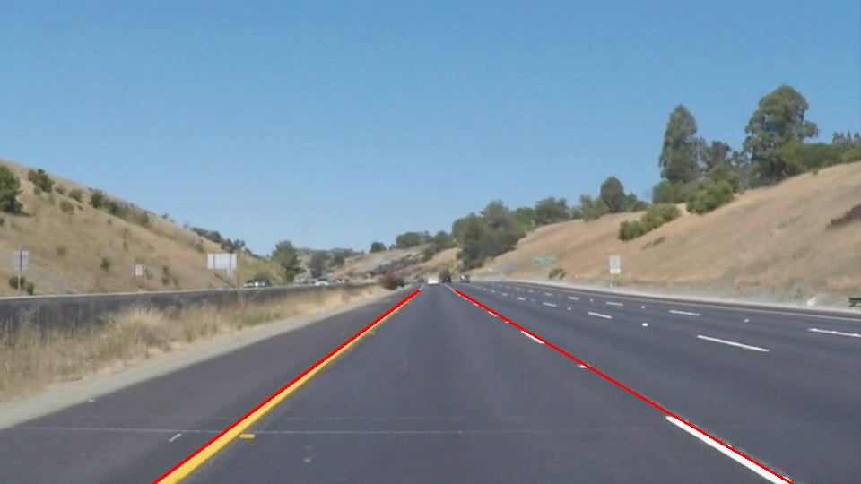

# **Finding Lane Lines on the Road** 

The goal of this project is to use basic compute vision techniques to find lane lines on the road.
The detected lane lines are annotated in the test images and videos.

[//]: # (Image References)

[image1]: ./examples/grayscale.jpg "Grayscale"

---

### Reflection

### 1. Pipeline

The pipeline works as follows:
1. Convert the image to grayscale.
2. Create a color mask with threshold (200, 200, 20) which identifies white and yellow lines.
3. Create a trapezoid region mask.
4. Apply Canny edges and Hough line detection.
5. In order to draw a single line on the left and right lanes, I modified the draw_lines() by separating the line segments to two lists based on sign of their slopes, then applying linear regression on the line segments respectively. I further improved it by grouping the line segments by their (slope, intercept) and using only the group with maximum sum of line lengths. See extrapolate_lines_advanced().

### 2. Identify potential shortcomings with your current pipeline

One shortcoming is that outliers in the line segments vastly change the single left and right lines.

### 3. Suggest possible improvements to your pipeline

One way to filter the outlier line segments is to restrict the range of the slopes,
 and make sure the lines extrapolate on bottom of the image.
Another improvement would be to use lengths of the line segments as a weighting
factor in the linear regression, or even use a quadratic regression since the
 lane lines in the challenge video are not straight lines.

### Demo
Below are the output test images:

